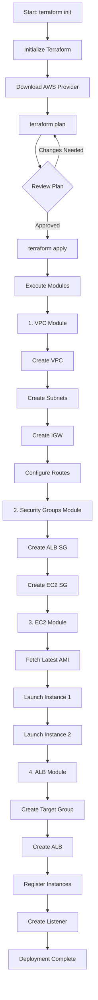
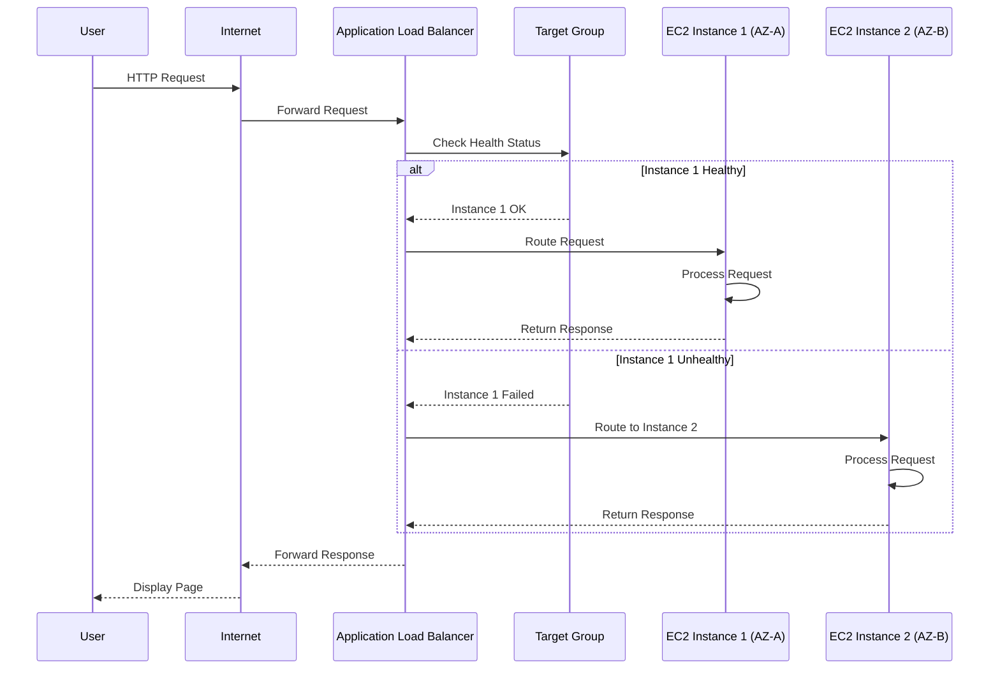
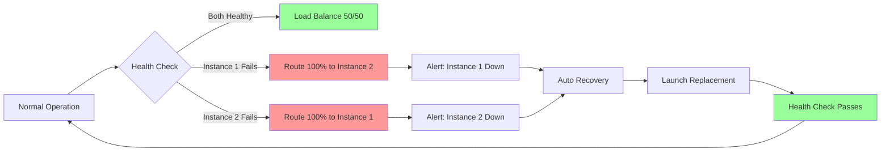

# aws-highly-available-web-app
This project demonstrates how to design and deploy a highly available web application architecture on AWS by distributing traffic across multiple Availability Zones. The setup ensures fault tolerance, scalability, and high availability using core AWS networking and compute services.. 
# 🚀 AWS Highly Available Web Application with Terraform


A production-ready, highly available web application infrastructure deployed on AWS using Terraform modules. This project demonstrates cloud-native best practices for building resilient, scalable applications.

---

## 📋 Table of Contents

- [Problem Statement](#-problem-statement)
- [Why This Project?](#-why-this-project)
- [Solution Architecture](#-solution-architecture)
- [Features](#-features)
- [Prerequisites](#-prerequisites)
- [Project Structure](#-project-structure)
- [Quick Start](#-quick-start)
- [Module Documentation](#-module-documentation)
- [Workflow Diagram](#-workflow-diagram)
- [Testing & Validation](#-testing--validation)
- [Cost Estimation](#-cost-estimation)
- [Troubleshooting](#-troubleshooting)
- [Best Practices](#-best-practices)
- [Contributing](#-contributing)
- [License](#-license)

---

## 🎯 Problem Statement

Modern web applications face several critical challenges:

### 1. **Single Point of Failure**
- **Problem**: Traditional single-server deployments become unavailable if the server fails
- **Impact**: Complete service outage, revenue loss, customer dissatisfaction
- **Real-world scenario**: Your e-commerce site goes down during Black Friday sales

### 2. **Availability Zone Failures**
- **Problem**: Entire data centers can experience outages (power failure, natural disasters, network issues) 
- **Impact**: Regional service disruption affecting thousands of customers
- **Real-world scenario**: AWS us-east-1 outage in December 2021 affected major services

### 3. **Traffic Distribution**
- **Problem**: Single server cannot handle high traffic loads efficiently
- **Impact**: Slow response times, server crashes, poor user experience
- **Real-world scenario**: Your application trending on social media causes server overload

### 4. **Manual Infrastructure Management**
- **Problem**: Manual server setup is error-prone, time-consuming, and not reproducible
- **Impact**: Configuration drift, deployment delays, inconsistent environments
- **Real-world scenario**: Dev environment works but production fails due to configuration differences

### 5. **Scalability Limitations**
- **Problem**: Vertical scaling (upgrading server) has limits and requires downtime
- **Impact**: Cannot handle traffic spikes, forced maintenance windows
- **Real-world scenario**: Unable to handle seasonal traffic increases

### 6. **No Automated Recovery**
- **Problem**: Failed instances require manual intervention to replace
- **Impact**: Extended downtime, requires 24/7 monitoring
- **Real-world scenario**: Instance crashes at 3 AM, waits until morning for manual restart

---

## 💡 Why This Project?

This project solves the above problems by providing:

### 1. **High Availability (HA)**
- ✅ Multi-AZ deployment ensures 99.99% uptime
- ✅ Automatic failover if one availability zone fails
- ✅ No single point of failure in the architecture

### 2. **Load Distribution**
- ✅ Application Load Balancer distributes traffic evenly
- ✅ Health checks automatically remove unhealthy instances
- ✅ Consistent performance under varying loads

### 3. **Infrastructure as Code (IaC)**
- ✅ Version-controlled infrastructure
- ✅ Reproducible deployments across environments
- ✅ Automated provisioning reduces human error

### 4. **Modular Design**
- ✅ Reusable Terraform modules
- ✅ Easy to maintain and extend
- ✅ Follows DRY (Don't Repeat Yourself) principle

### 5. **Security Best Practices**
- ✅ Security groups with least privilege access
- ✅ Private EC2 instances (only ALB exposed)
- ✅ Network isolation using VPC

### 6. **Cost Optimization**
- ✅ Right-sized instances (t2.micro for demo)
- ✅ Pay only for what you use
- ✅ Easy to scale up/down based on demand

---

## 🏗️ Solution Architecture

```
                                    Internet
                                       ↓
                    ┌──────────────────────────────────┐
                    │   Application Load Balancer      │
                    │  (Internet-facing, Multi-AZ)     │
                    └──────────────────────────────────┘
                                   ↓
                    ┌──────────────┴──────────────┐
                    ↓                             ↓
        ┌───────────────────────┐   ┌───────────────────────┐
        │   Availability Zone A │   │   Availability Zone B │
        │                       │   │                       │
        │  ┌─────────────────┐ │   │  ┌─────────────────┐ │
        │  │  Public Subnet  │ │   │  │  Public Subnet  │ │
        │  │  10.0.1.0/24    │ │   │  │  10.0.2.0/24    │ │
        │  │                 │ │   │  │                 │ │
        │  │  ┌───────────┐  │ │   │  │  ┌───────────┐  │ │
        │  │  │ EC2 Web   │  │ │   │  │  │ EC2 Web   │  │ │
        │  │  │ Instance  │  │ │   │  │  │ Instance  │  │ │
        │  │  │ (Apache)  │  │ │   │  │  │ (Apache)  │  │ │
        │  │  └───────────┘  │ │   │  │  └───────────┘  │ │
        │  └─────────────────┘ │   │  └─────────────────┘ │
        └───────────────────────┘   └───────────────────────┘
                    ↑                             ↑
                    └─────────────┬───────────────┘
                                  │
                    ┌─────────────────────────┐
                    │  Internet Gateway (IGW) │
                    └─────────────────────────┘
                                  ↑
                    ┌─────────────────────────┐
                    │     VPC 10.0.0.0/16     │
                    └─────────────────────────┘
```

### Architecture Components:

| Component | Purpose | High Availability Feature |
|-----------|---------|---------------------------|
| **VPC** | Network isolation | Spans multiple AZs |
| **2 Public Subnets** | Host resources in different AZs | AZ-level redundancy |
| **Internet Gateway** | Internet connectivity | Highly available by design |
| **Application Load Balancer** | Traffic distribution | Multi-AZ deployment |
| **2 EC2 Instances** | Web servers | Deployed across 2 AZs |
| **Security Groups** | Network firewall | Stateful protection |
| **Target Group** | Health monitoring | Auto-remove unhealthy targets |

---

## ✨ Features

### Infrastructure Features
- ✅ **Multi-AZ Deployment**: Resources spread across 2 availability zones
- ✅ **Auto-Scaling Ready**: Architecture supports adding Auto Scaling Groups
- ✅ **Health Monitoring**: ALB performs health checks every 30 seconds
- ✅ **Automated Recovery**: Unhealthy instances automatically removed from rotation
- ✅ **Zero-Downtime Updates**: Rolling updates possible with proper configuration

### Security Features
- ✅ **Network Segmentation**: VPC with isolated subnets
- ✅ **Least Privilege**: Security groups allow only necessary traffic
- ✅ **Private Instances**: EC2 instances only accessible via ALB
- ✅ **HTTP Only**: Simplified for demo (HTTPS can be added)

### Operational Features
- ✅ **Infrastructure as Code**: Complete automation with Terraform
- ✅ **Modular Design**: Reusable modules for different environments
- ✅ **Version Control**: Track infrastructure changes over time
- ✅ **Easy Rollback**: Revert to previous stable states
- ✅ **Documentation**: Self-documenting code with proper naming

---

## 📦 Prerequisites

### Required Tools
- **Terraform** >= 1.0 ([Installation Guide](https://learn.hashicorp.com/tutorials/terraform/install-cli))
- **AWS CLI** >= 2.0 ([Installation Guide](https://docs.aws.amazon.com/cli/latest/userguide/install-cliv2.html))
- **Git** ([Installation Guide](https://git-scm.com/downloads))

### AWS Requirements
- AWS Account with appropriate permissions
- AWS Access Key ID and Secret Access Key
- IAM permissions for:
  - VPC creation and management
  - EC2 instance creation
  - Load Balancer creation
  - Security Group management

### Configure AWS CLI
```bash
aws configure
# Enter your AWS Access Key ID
# Enter your AWS Secret Access Key
# Default region: us-east-1
# Default output format: json
```

---

## 📁 Project Structure

```
aws-highly-available-web-app/
├── README.md                          # This file
├── main.tf                            # Root module - orchestrates all modules
├── variables.tf                       # Input variables
├── outputs.tf                         # Output values
├── terraform.tfvars                   # Variable values (optional)
├── .gitignore                         # Git ignore file
│
└── modules/                           # Terraform modules directory
    │
    ├── vpc/                           # VPC Module
    │   ├── main.tf                    # VPC, subnets, IGW, route tables
    │   ├── variables.tf               # Module input variables
    │   └── outputs.tf                 # Module outputs
    │
    ├── security-groups/               # Security Groups Module
    │   ├── main.tf                    # ALB and EC2 security groups
    │   ├── variables.tf               # Module input variables
    │   └── outputs.tf                 # Module outputs
    │
    ├── ec2/                           # EC2 Module
    │   ├── main.tf                    # EC2 instances with user data
    │   ├── variables.tf               # Module input variables
    │   └── outputs.tf                 # Module outputs
    │
    └── alb/                           # Application Load Balancer Module
        ├── main.tf                    # ALB, target group, listener
        ├── variables.tf               # Module input variables
        └── outputs.tf                 # Module outputs
```

### Module Descriptions

#### 1. **VPC Module** (`modules/vpc/`)
**Purpose**: Creates isolated network infrastructure

**Resources Created**:
- 1 VPC with DNS support
- 2 Public subnets in different AZs
- 1 Internet Gateway
- 1 Route table with internet route
- Route table associations

**Key Features**:
- CIDR: 10.0.0.0/16
- Subnets: 10.0.1.0/24, 10.0.2.0/24
- Auto-assign public IPs enabled

#### 2. **Security Groups Module** (`modules/security-groups/`)
**Purpose**: Implements network security policies

**Resources Created**:
- ALB Security Group (allows HTTP from internet)
- EC2 Security Group (allows HTTP from ALB only)

**Security Model**:
```
Internet → ALB (Port 80) → EC2 Instances (Port 80)
         (0.0.0.0/0)      (ALB SG only)
```

#### 3. **EC2 Module** (`modules/ec2/`)
**Purpose**: Provisions web server instances

**Resources Created**:
- 2 EC2 instances (t2.micro)
- Automated Apache installation via user data
- Custom HTML pages showing instance info

**Features**:
- Latest Amazon Linux 2023 AMI
- Automatic web server setup
- Instance metadata display

#### 4. **ALB Module** (`modules/alb/`)
**Purpose**: Distributes traffic and monitors health

**Resources Created**:
- Application Load Balancer
- Target Group (HTTP:80)
- Listener (HTTP:80)
- Target Group Attachments

**Health Check Configuration**:
- Path: `/`
- Interval: 30 seconds
- Timeout: 5 seconds
- Healthy threshold: 2
- Unhealthy threshold: 2

---

## 🚀 Quick Start

### Step 1: Clone the Repository
```bash
git clone https://github.com/yourusername/aws-highly-available-web-app.git
cd aws-highly-available-web-app
```

### Step 2: Review and Customize Variables (Optional)
Edit `terraform.tfvars`:
```hcl
aws_region           = "us-east-1"
project_name         = "my-ha-webapp"
vpc_cidr             = "10.0.0.0/16"
public_subnet_cidrs  = ["10.0.1.0/24", "10.0.2.0/24"]
instance_type        = "t2.micro"
key_name             = ""  # Optional: Add SSH key name
```

### Step 3: Initialize Terraform
```bash
terraform init
```
This downloads required providers and initializes modules.

### Step 4: Review the Plan
```bash
terraform plan
```
Review the 16 resources that will be created.

### Step 5: Deploy Infrastructure
```bash
terraform apply
```
Type `yes` when prompted. Deployment takes ~3-5 minutes.

### Step 6: Get the Application URL
```bash
terraform output alb_url
```
Output example:
```
alb_url = "http://highly-available-web-app-alb-1234567890.us-east-1.elb.amazonaws.com"
```

### Step 7: Test the Application
```bash
# Open in browser
open $(terraform output -raw alb_url)

# Or use curl
curl $(terraform output -raw alb_url)
```

Refresh multiple times to see load balancing in action!

---

## 📚 Module Documentation

### VPC Module

**Inputs**:
| Variable | Type | Default | Description |
|----------|------|---------|-------------|
| `vpc_cidr` | string | `10.0.0.0/16` | CIDR block for VPC |
| `public_subnet_cidrs` | list(string) | `["10.0.1.0/24", "10.0.2.0/24"]` | CIDR blocks for subnets |
| `availability_zones` | list(string) | - | List of AZs to use |
| `project_name` | string | - | Project name for tagging |

**Outputs**:
| Output | Description |
|--------|-------------|
| `vpc_id` | ID of the created VPC |
| `public_subnet_ids` | List of public subnet IDs |
| `internet_gateway_id` | ID of the Internet Gateway |

### Security Groups Module

**Inputs**:
| Variable | Type | Description |
|----------|------|-------------|
| `vpc_id` | string | VPC ID where SGs will be created |
| `project_name` | string | Project name for tagging |

**Outputs**:
| Output | Description |
|--------|-------------|
| `alb_security_group_id` | ID of ALB security group |
| `ec2_security_group_id` | ID of EC2 security group |

### EC2 Module

**Inputs**:
| Variable | Type | Default | Description |
|----------|------|---------|-------------|
| `ami_id` | string | `""` | AMI ID (empty = latest AL2023) |
| `instance_type` | string | `t2.micro` | EC2 instance type |
| `subnet_ids` | list(string) | - | Subnet IDs for instances |
| `security_group_id` | string | - | Security group ID |
| `project_name` | string | - | Project name for tagging |
| `key_name` | string | `""` | SSH key name (optional) |

**Outputs**:
| Output | Description |
|--------|-------------|
| `instance_ids` | List of EC2 instance IDs |
| `instance_private_ips` | Private IP addresses |

### ALB Module

**Inputs**:
| Variable | Type | Description |
|----------|------|-------------|
| `vpc_id` | string | VPC ID for ALB |
| `subnet_ids` | list(string) | Subnet IDs (min 2 AZs) |
| `security_group_id` | string | Security group ID for ALB |
| `instance_ids` | list(string) | EC2 instance IDs to register |
| `project_name` | string | Project name for tagging |

**Outputs**:
| Output | Description |
|--------|-------------|
| `alb_dns_name` | DNS name of the ALB |
| `alb_arn` | ARN of the ALB |
| `target_group_arn` | ARN of the target group |

---

## 🔄 Workflow Diagram

### Deployment Workflow



### Traffic Flow



### High Availability Scenario



---

## 🧪 Testing & Validation

### 1. Test Load Balancing
```bash
# Make multiple requests
for i in {1..10}; do
  curl -s $(terraform output -raw alb_url) | grep "Instance"
  sleep 1
done
```

Expected output alternates between instances:
```
Instance: i-0abc123...
Instance: i-0def456...
Instance: i-0abc123...
```

### 2. Test High Availability
```bash
# Get instance IDs
terraform output instance_ids

# Stop one instance in AWS Console
# Continue making requests - should still work

# Verify traffic goes only to healthy instance
watch -n 2 'curl -s $(terraform output -raw alb_url) | grep "Instance"'
```

### 3. Verify Security Groups
```bash
# Try accessing EC2 directly (should fail)
EC2_IP=$(aws ec2 describe-instances --filters "Name=tag:Name,Values=*instance-1" --query 'Reservations[0].Instances[0].PublicIpAddress' --output text)
curl http://$EC2_IP  # Should timeout (security group blocks direct access)

# Access via ALB (should work)
curl $(terraform output -raw alb_url)  # Should return HTML
```

### 4. Health Check Monitoring
```bash
# Check target health in AWS Console or via CLI
aws elbv2 describe-target-health \
  --target-group-arn $(terraform output -raw target_group_arn)
```

Expected output:
```json
{
    "TargetHealthDescriptions": [
        {
            "Target": {"Id": "i-0abc123", "Port": 80},
            "HealthCheckPort": "80",
            "TargetHealth": {"State": "healthy"}
        },
        {
            "Target": {"Id": "i-0def456", "Port": 80},
            "HealthCheckPort": "80",
            "TargetHealth": {"State": "healthy"}
        }
    ]
}
```

---

## 💰 Cost Estimation

### Monthly Cost Breakdown (us-east-1)

| Resource | Quantity | Unit Cost | Monthly Cost |
|----------|----------|-----------|--------------|
| **EC2 t2.micro** | 2 | $0.0116/hour | ~$17.00 |
| **Application Load Balancer** | 1 | $0.0225/hour | ~$16.20 |
| **ALB LCU** | Varies | $0.008/hour | ~$5.76 |
| **Data Transfer** | 1 GB | $0.09/GB | ~$0.09 |
| **VPC** | 1 | Free | $0.00 |
| **Internet Gateway** | 1 | Free | $0.00 |
| **Elastic IPs** | 0 | Free (in use) | $0.00 |
| | | **Total** | **~$39.05/month** |

### Cost Optimization Tips
1. **Use t3.micro** instead of t2.micro (better performance, similar cost)
2. **Enable auto-scaling** to scale down during low traffic
3. **Use Reserved Instances** for 30-40% savings on EC2
4. **Delete resources** when not in use: `terraform destroy`
5. **Monitor usage** with AWS Cost Explorer

### Free Tier Eligible
- ✅ 750 hours/month of t2.micro EC2 instances (first 12 months)
- ✅ 15 GB data transfer out (always free)
- ❌ ALB not included in free tier

---

## 🔧 Troubleshooting

### Common Issues

#### Issue 1: AMI Not Found
```
Error: InvalidAMIID.NotFound
```
**Solution**: The EC2 module now automatically fetches the latest AMI. Ensure `ami_id` variable is empty.

#### Issue 2: ALB Returns 503 Error
**Symptoms**: ALB accessible but returns 503 Service Unavailable

**Troubleshooting Steps**:
```bash
# Check target health
aws elbv2 describe-target-health --target-group-arn $(terraform output -raw target_group_arn)

# Check instance status
aws ec2 describe-instance-status --instance-ids $(terraform output -json instance_ids | jq -r '.[]')

# SSH into instance (if key configured)
ssh -i your-key.pem ec2-user@<instance-ip>
sudo systemctl status httpd
sudo cat /var/log/httpd/error_log
```

**Common Causes**:
- Instances not healthy (check user data script)
- Security groups misconfigured
- Web server not running

#### Issue 3: Cannot Access ALB
**Symptoms**: ALB DNS name doesn't resolve or times out

**Solutions**:
```bash
# Verify ALB is active
aws elbv2 describe-load-balancers --names highly-available-web-app-alb

# Check security group
aws ec2 describe-security-groups --group-ids $(terraform output -raw alb_security_group_id)

# Wait for DNS propagation (up to 5 minutes)
dig $(terraform output -raw alb_dns_name)
```

#### Issue 4: Terraform State Lock
```
Error: Error acquiring the state lock
```
**Solution**:
```bash
# If you're sure no other process is running
terraform force-unlock <LOCK_ID>
```

#### Issue 5: Insufficient Permissions
```
Error: UnauthorizedOperation
```
**Solution**: Ensure your IAM user/role has these policies:
- AmazonVPCFullAccess
- AmazonEC2FullAccess
- ElasticLoadBalancingFullAccess

### Debug Commands

```bash
# Validate Terraform configuration
terraform validate

# Format Terraform files
terraform fmt -recursive

# Show current state
terraform show

# List all resources
terraform state list

# Inspect specific resource
terraform state show module.vpc.aws_vpc.main

# Enable debug logging
export TF_LOG=DEBUG
terraform apply

# AWS CLI debug
aws ec2 describe-instances --debug
```

---

## 🎯 Best Practices

### Infrastructure as Code
- ✅ **Version Control**: Always commit `.tf` files to Git
- ✅ **Remote State**: Use S3 backend for team collaboration
- ✅ **State Locking**: Use DynamoDB for state locking
- ✅ **Modules**: Keep modules reusable and generic
- ✅ **Variables**: Use variables for all configurable values

### Security
- ✅ **Least Privilege**: Restrict security group rules
- ✅ **Private Subnets**: Move EC2 to private subnets (advanced)
- ✅ **HTTPS**: Add SSL/TLS certificates (recommended for production)
- ✅ **Secrets Management**: Use AWS Secrets Manager for sensitive data
- ✅ **IAM Roles**: Use IAM roles instead of access keys

### High Availability
- ✅ **Multi-AZ**: Always deploy across multiple AZs
- ✅ **Health Checks**: Configure appropriate health check intervals
- ✅ **Auto Scaling**: Add Auto Scaling Groups for production
- ✅ **Monitoring**: Set up CloudWatch alarms
- ✅ **Backups**: Implement backup strategies

### Cost Management
- ✅ **Right-sizing**: Use appropriate instance types
- ✅ **Tagging**: Tag all resources for cost allocation
- ✅ **Monitoring**: Set up billing alerts
- ✅ **Cleanup**: Destroy unused environments
- ✅ **Reserved Instances**: For long-term workloads

---

## 🚀 Advanced Enhancements

### 1. Add Auto Scaling
```hcl
# Add to modules/ec2/main.tf
resource "aws_autoscaling_group" "web" {
  name                = "${var.project_name}-asg"
  vpc_zone_identifier = var.subnet_ids
  target_group_arns   = [var.target_group_arn]
  health_check_type   = "ELB"
  min_size            = 2
  max_size            = 6
  desired_capacity    = 2

  launch_template {
    id      = aws_launch_template.web.id
    version = "$Latest"
  }

  tag {
    key                 = "Name"
    value               = "${var.project_name}-asg-instance"
    propagate_at_launch = true
  }
}
```

### 2. Add HTTPS Support
```hcl
# Add to modules/alb/main.tf
resource "aws_lb_listener" "https" {
  load_balancer_arn = aws_lb.main.arn
  port              = "443"
  protocol          = "HTTPS"
  ssl_policy        = "ELBSecurityPolicy-2016-08"
  certificate_arn   = var.certificate_arn

  default_action {
    type             = "forward"
    target_group_arn = aws_lb_target_group.main.arn
  }
}
```

### 3. Add CloudWatch Monitoring
```hcl
resource "aws_cloudwatch_metric_alarm" "high_cpu" {
  alarm_name          = "${var.project_name}-high-cpu"
  comparison_operator = "GreaterThanThreshold"
  evaluation_periods  = "2"
  metric_name         = "CPUUtilization"
  namespace           = "AWS/EC2"
  period              = "120"
  statistic           = "Average"
  threshold           = "80"
  alarm_description   = "This metric monitors ec2 cpu utilization"
  alarm_actions       = [aws_sns_topic.alerts.arn]
}
```

### 4. Add RDS Database
```hcl
# modules/rds/main.tf
resource "aws_db_instance" "main" {
  identifier           = "${var.project_name}-db"
  engine               = "mysql"
  engine_version       = "8.0"
  instance_class       = "db.t3.micro"
  allocated_storage    = 20
  db_name              = var.database_name
  username             = var.database_username
  password             = var.database_password
  multi_az             = true
  skip_final_snapshot  = true
}
```

---

## 🧹 Cleanup

### Destroy Infrastructure
```bash
# Review what will be destroyed
terraform plan -destroy

# Destroy all resources
terraform destroy

# Confirm with 'yes'
```

### Verify Cleanup
```bash
# Check for remaining resources
aws ec2 describe-instances --filters "Name=tag:Name,Values=*highly-available-web-app*"
aws elbv2 describe-load-balancers --names highly-available-web-app-alb
aws ec2 describe-vpcs --filters "Name=tag:Name,Values=*highly-available-web-app*"
```

### Manual Cleanup (if needed)
```bash
# Delete load balancer
aws elbv2 delete-load-balancer --load-balancer-arn <arn>

# Terminate instances
aws ec2 terminate-instances --instance-ids <id1> <id2>

# Delete VPC
aws ec2 delete-vpc --vpc-id <vpc-id>
```

---

## 📊 Monitoring & Observability

### CloudWatch Metrics to Monitor
- ALB Request Count
- ALB Target Response Time
- EC2 CPU Utilization
- EC2 Network In/Out
- Target Group Healthy/Unhealthy Count

### Set Up CloudWatch Dashboard
